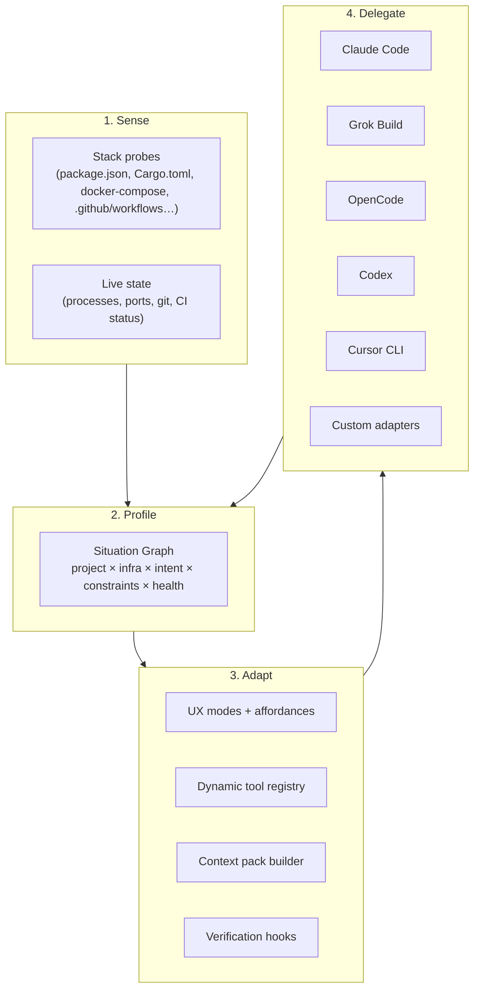
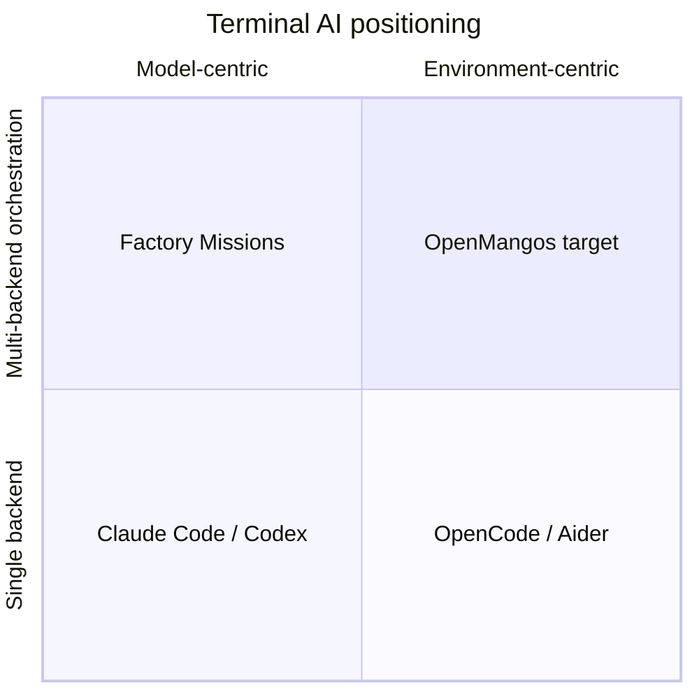

# OpenMangos — Concept Document

**Vektra Industries · Software Division**  
**Status:** Draft v0.1 · June 2026  
**Author:** Pablo Navarro + Grok Build session

---

## One-liner

OpenMangos is an **adaptive terminal framework** — not another AI coding CLI. It senses the infrastructure you are standing in, builds a structured situation model, reshapes its affordances to match the problem class, and orchestrates any AI backend (Claude Code, Grok Build, OpenCode, Codex, Cursor CLI, etc.) with enriched context.

> **The terminal adapts to the problem. The model adapts to the terminal.**

---

## OpenMango — the open bet

**OpenMangos** is the product name. **OpenMango** is the same thing — one mango, open by default. You'll see both on X and in the wild.

The pattern in 2026 is familiar: beautiful agent experiences ship in tiers. A public baseline. A premium surface behind glass — invite-only, API-gated, or "available to partners." The substrate stays closed. Your memory stays in their vault. Your terminal stays their UX.

OpenMango is the opposite wager:

| Closed agent product | OpenMango |
|---|---|
| One vendor's model + UI | Any backend — OpenCode, Grok, Claude, Codex, Cursor |
| Session memory in a walled garden | **Mangos Drive** on open AgentDrive — your namespace, your swarms |
| "Trust us" orchestration | `om sense` → explainable situation graph; you see what adapted and why |
| Install = account + subscription | `curl \| bash` → source on disk, Apache-2.0, forkable |

We are not building another fable you rent. We are building the **operator layer** that stays public — the part that should have been open from the start: sense the real environment, pack honest context, route to the best tool, verify when work is done, remember across sessions without lock-in.

Anthropic can keep the premium narrative models behind the door. OpenMango keeps the **terminal, the memory fabric, and the orchestration** on your machine, in the open, composable with whatever model you already trust.

That is the point of the hard hat on the mascot. This is infrastructure work — not a demo behind glass.

---

## The problem

Today's terminal-native AI agents share the same skeleton:

```
User → Static TUI → Single model → Fixed tool set → Filesystem
```

Whether you are in a Rust monorepo, a Next.js app, a Kubernetes cluster, or a game engine, you get the same prompt surface, the same slash commands, the same mental model. **Adaptation is dumped entirely on the model's context window** and whatever skills/MCP servers you manually configured.

That works for "edit files in a repo." It breaks down when:

| Scenario | What breaks |
|---|---|
| **Infra / ops** | Needs live state (ports, containers, cloud resources), not just static files |
| **Multi-repo / monorepo** | Needs topology-aware navigation, not flat file trees |
| **Brownfield projects** | Needs accumulated project DNA, not cold-start every session |
| **Long-horizon work** | Needs orchestration, validation loops, and handoff — not one chat thread |
| **Model choice** | Different backends excel at different tasks, but the shell treats them as interchangeable pipes |
| **Verification** | "Done" means the model stopped talking, not that tests pass or infra is healthy |

The terminal is **present** but not **adaptive**. OpenMangos fixes that layer.

---

## What OpenMangos is (and is not)

### Is

- A **framework runtime** that wraps, enriches, and orchestrates existing AI CLIs
- An **environment-first** shell that profiles workspace + infra + runtime state
- A **provider-agnostic adapter layer** with a unified situation graph
- A **mode engine** that changes UX affordances, tools, guardrails, and verification per problem class
- Open, pluggable, and local-first by default

### Is not

- A replacement for Claude Code, Grok Build, OpenCode, or Codex
- Another walled-garden model subscription
- A full IDE rebuild
- Magic — every adaptation must be **explainable** ("detected docker-compose + failing healthcheck → debug mode")

---

## Core architecture



### Layer 1 — Sense (probe)

On `om` (or `openmangos`) in any directory, lightweight detectors run incrementally:

| Probe family | Examples |
|---|---|
| **Project DNA** | Language, framework, monorepo layout, test runner, linter, formatter |
| **Infra DNA** | Docker, Compose, K8s manifests, Terraform, Fly/Vercel/Railway configs |
| **Workflow DNA** | Git branch, dirty files, recent CI failures, open PRs |
| **Runtime DNA** | Listening ports, dev servers up/down, DB reachable, container health |

Probes are **fast, cached, and incremental** — not a full scan every keystroke.

### Layer 2 — Profile (situation graph)

Raw probes become a structured **situation model**, not a wall of text:

```yaml
# .openmangos/profile.yaml (generated + user-tunable)
workspace: OpenMangos
stack: [typescript, node, turborepo]
infra: [docker-compose.postgres]
intent: debug          # inferred or user-set
mode: debug
constraints: [no-prod-writes, offline-ok]
health:
  tests: failing (auth.spec.ts)
  dev_server: up :3000
  db: reachable
backends:
  preferred: grok
  available: [grok, claude, opencode, codex]
```

Both the human and every AI backend read from this graph. Prior art in the Vektra stack:

- **AgentDrive** — long-term structural memory across sessions
- **vektra-engine terminal bridge** — external CLI driving contextual in-editor state

OpenMangos generalizes that pattern to **any** workspace.

### Layer 3 — Adapt (the product)

| Capability | Behavior |
|---|---|
| **Modes** | `build`, `debug`, `infra`, `review`, `ship` — switch manually or accept suggestions |
| **Command palette** | Only show commands that make sense here (`om test`, `om logs api`, `om plan`) |
| **Context packs** | Auto-built briefings injected into whichever backend is active |
| **Guardrails** | Infra mode blocks destructive ops; review mode requires diff before write |
| **Verification** | After model acts, run the right checks for *this* stack (typecheck, smoke test, `terraform plan`, health ping) |

The terminal **feels different** in a Python data pipeline vs. a React app vs. a Terraform repo — because it *is* different.

### Layer 4 — Delegate (provider-agnostic)

OpenMangos orchestrates backends; it does not compete with them:

```bash
om session start --backend grok     # default for this workspace
om ask "fix the auth test"          # OpenMangos enriches context; Grok executes
om handoff --to claude              # switch backend, keep situation graph
```

Each backend receives the same enriched situation model. Routing can be manual or heuristic (research → Grok, long refactor → Claude, fast edits → Codex).

---

## Competitive landscape (June 2026)

Research across terminal-native AI agents reveals a converging feature set — but **no one owns the adaptive substrate layer**.

### Summary matrix

| Product | Model lock-in | Project init | Multi-model / orchestration | Long-horizon missions | Infra / ops aware | Open source | OpenMangos gap |
|---|---|---|---|---|---|---|---|
| **[Factory Droid](https://factory.ai/)** | Factory platform | `/init`, AGENTS.md | Missions: orchestrator + workers + validators per role | **Strong** — multi-day, git-coordinated | Enterprise MCP (Jira, Slack); not infra-native | No | Locked to Droid; no environment adaptation |
| **[OpenCode](https://opencode.ai/)** | Bring your own keys | `/init` → AGENTS.md | Plan/Build modes; provider choice | Session-based | File-centric | **Yes** | Same static TUI everywhere |
| **[Claude Code](https://docs.anthropic.com/en/docs/claude-code)** | Anthropic | CLAUDE.md, skills | Subagents, hooks | Session + tasks | Bash + MCP | No | Anthropic ecosystem |
| **[Grok Build](https://grok.com/build)** | xAI | Skills, MCP, AGENTS.md | Subagents, background shells | Session-based | Bash + MCP | Partial (skills) | Same shell regardless of infra |
| **[Codex CLI](https://github.com/openai/codex)** | OpenAI | AGENTS.md | Sandbox modes | Session-based | Bash | **Yes** | Code-first; no situation graph |
| **[Cursor CLI](https://cursor.com/docs/cli/overview)** | Cursor models | Editor parity | Agent / Plan / Ask; Cloud Agent handoff | Cloud continuation | Sandbox controls | No | Cursor subscription |
| **[Aider](https://aider.chat/)** | BYOK | Repo map (graph-ranked) | Architect mode (plan vs edit) | Chat turns | Git-centric | **Yes** | Best repo map; no infra/live state |
| **[Gemini CLI + Conductor](https://github.com/gemini-cli-extensions/conductor)** | Google | Conductor specs/plans in repo | Context-driven tracks | Track-based (`plan.md`) | Extension model | **Yes** | Brownfield context docs; not live adaptation |
| **[Amazon Q Developer CLI](https://aws.amazon.com/q/developer/)** | AWS | Project directory context | Custom agents | Ops workflows | **Strong for AWS** — `use_aws`, log correlation | No | AWS-only; not general framework |
| **[Warp](https://docs.warp.dev/)** | Multiple | Agent Mode in terminal | Blocks, workflows | Interactive | Shell history aware | No | Terminal UX innovation; not infra framework |
| **[Verdent](https://www.verdent.ai/)** | Multi-model platform | Desktop + Deck (parallel agents) | Parallel agent orchestration | Multi-hour builds | Product-building focus | No | Autonomous product builder, not adaptive shell |

---

## Deep dives — what each teaches us

### Factory.ai (primary reference)

[Factory](https://factory.ai/) positions itself as **"agent-native software development"** powered by **Droid**. Their terminal UI is polished and enterprise-oriented.

**What Factory does well:**

- **Full-screen TUI** with slash commands (`/skills`, `/missions`, `/mcp`, `/model`, `/review`, `/fork`, `/compress`)
- **Persistent sessions** — fork, resume, favorite across days
- **Cross-surface sync** — TUI, desktop, web, IDE, Slack share sessions and skills
- **Missions** ([announced Feb 2025](https://factory.ai/news/missions)) — multi-day autonomous projects:
  - Orchestrator decomposes work into milestones and features
  - Fresh worker sessions per feature (clean context)
  - Validation workers run tests, lint, typecheck, and **computer use** (UI QA)
  - Git as source of truth for coordination
  - **Model routing by role** — e.g. Opus for orchestration, Sonnet for implementation, GPT-5.3-Codex for validation, Kimi for research
- **Enterprise security** — Droid Shield (secret scanning), risk-classified commands, hooks, OpenTelemetry, airgapped deploy
- **Skills ecosystem** — portable, repo-checkinable procedures

**What Factory does not do (OpenMangos opportunity):**

- **Environment adaptation** — same Droid experience in a Terraform repo vs. a React app vs. a bare shell directory
- **Provider freedom** — locked to Factory's Droid and billing
- **Live infra sensing** — relies on model + MCP to discover runtime state each time
- **Explainable mode switching** — no "you are in debug mode because X" substrate

**Takeaway for OpenMangos:** Factory proves the market wants **orchestration + multi-model routing + long missions**. OpenMangos should offer that orchestration pattern as a **backend-agnostic, environment-aware framework** — not a competing closed platform.

---

### OpenCode

[OpenCode](https://opencode.ai/) is the leading **open-source, terminal-native, multi-provider** agent (SST/anomalyco).

**Strengths:** `/init` generates `AGENTS.md`; Plan/Build mode toggle; `@` file fuzzy search; `/undo`/`/redo`; themes and formatters; provider flexibility.

**Gap:** Initialization is a one-time project doc. The TUI does not reshape when you switch from app code to infra debugging. Same experience everywhere.

**Takeaway:** OpenMangos should be an **OpenCode adapter** on day one — inject situation packs via env or wrapper, not fork OpenCode.

---

### Aider — repo map as prior art

[Aider's repository map](https://aider.chat/docs/repomap.html) is the best **codebase adaptation** pattern in the space:

- Graph-ranked symbol map sent with every request
- Dynamically sized to token budget (`--map-tokens`)
- Model requests specific files when map is insufficient

**Takeaway:** OpenMangos extends this idea beyond **code symbols** to **infra symbols** — services, ports, cloud resources, CI jobs, health endpoints.

---

### Google Conductor — context as artifact

[Conductor](https://developers.googleblog.com/conductor-introducing-context-driven-development-for-gemini-cli/) (Gemini CLI extension) treats **context as managed Markdown artifacts**:

- `/conductor:setup` — product, tech stack, workflow preferences
- `/conductor:newTrack` — spec + plan before code
- `/conductor:implement` — agent works through `plan.md` with checkpoints

**Strengths:** Brownfield-friendly; persistent context in repo; team-shareable.

**Gap:** Static documents, not live sensing. No mode engine or infra probes.

**Takeaway:** OpenMangos situation graph complements Conductor-style artifacts with **live state** and **dynamic modes**.

---

### Amazon Q Developer CLI — infra-native agent

[AWS blog case study](https://aws.amazon.com/blogs/devops/streamline-operational-troubleshooting-with-amazon-q-developer-cli/) shows the strongest **ops adaptation** pattern:

- Started in project directory → inferred ECS architecture without being told
- `use_aws` tool for natural-language AWS CLI
- Log correlation across CloudWatch groups
- Root cause → code fix → CDK deploy → curl validation

**Takeaway:** This is exactly the **debug/infra mode** OpenMangos should generalize beyond AWS — Docker, K8s, Terraform, Fly, Vercel, local process graphs.

---

### Cursor CLI — editor parity in terminal

[Cursor CLI](https://cursor.com/docs/cli/overview) mirrors editor modes (Agent / Plan / Ask), sandbox controls, session resume, and Cloud Agent handoff (`&` prefix).

**Takeaway:** Session continuity and mode switching are table stakes. OpenMangos adds **environment-driven mode suggestion** on top.

---

### Verdent — parallel autonomous builders

[Verdent](https://www.verdent.ai/) targets **product launch** with parallel agents (Deck), memory of preferences, and multi-hour autonomous builds. Less terminal-framework, more autonomous product studio.

**Takeaway:** Parallel orchestration is valuable for OpenMangos Phase 2+, but the core differentiator remains **adaptive substrate**, not autonomous app generation.

---

## Where OpenMangos wins



| Dimension | Incumbents | OpenMangos |
|---|---|---|
| **Primary object** | The model session | The **situation** you are in |
| **Context** | Files + chat history | **Situation graph** (stack + infra + live state + intent) |
| **UX** | One TUI forever | **Modes** that reshape affordances |
| **Backends** | Locked or BYOK-with-same-shell | **Orchestrated adapters** with shared context |
| **Verification** | Model says done | **Stack-appropriate checks** auto-run |
| **Memory** | Session or AGENTS.md | Situation graph + optional **AgentDrive** persistence |
| **Openness** | Mixed | **Framework spec + open core** |

---

## Modes (v0)

| Mode | Triggered when | Affordances | Guardrails |
|---|---|---|---|
| **build** | Default; feature work detected | Full write, test on save, format hooks | Standard sandbox |
| **debug** | Failing tests, unhealthy services, error logs | Log tail, port scan, repro commands, bisect helpers | Read-mostly on prod configs |
| **infra** | Terraform, K8s, Docker, cloud configs detected | Plan/diff first, deploy commands, health checks | Block destructive without confirm |
| **review** | PR branch, `/review`, pre-commit | Diff-centric, no writes without approval | Write blocked by default |
| **ship** | Release tags, CI green, deploy configs | Changelog, version bump, deploy pipeline | Require verification pass |

Mode switches are always **logged and explainable**:

```
→ debug mode
  because: jest failing (auth.spec.ts), postgres container unhealthy, dev server up :3000
```

---

## Project structure (proposed)

```
openmangos/
├── core/              # probe engine, situation graph, mode engine
├── adapters/          # claude, grok, opencode, codex, cursor
├── probes/            # pluggable stack detectors
├── modes/             # dev, debug, infra, review, ship
├── packs/             # context pack templates per mode
├── verify/            # post-action verification runners
└── cli/               # `om` command entrypoint
```

---

## MVP roadmap

### Phase 0 — "Smart shell" (prove the concept)

**North star command:**

```bash
om sense
```

Prints a rich situation report of the current directory. If this is immediately more useful than `ls` + opening Claude Code cold, the concept is validated.

Deliverables:

- [ ] `om sense` — probe + print situation report
- [ ] `om mode [build|debug|infra|review|ship]` — manual mode switch
- [ ] `om pack` — export context pack (JSON/Markdown) for any AI CLI
- [ ] `om wrap <backend>` — launch Claude/Grok/OpenCode with injected `OPENMANGOS_CONTEXT`
- [ ] `.openmangos/profile.yaml` — generated, user-tunable

**Probe priority (ship these first):**

1. TypeScript/Node (package.json, tsconfig, vitest/jest)
2. Python (pyproject, pytest, venv)
3. Docker / Compose
4. Git (branch, dirty state, recent commits)
5. Terraform (plan-safe hooks)

### Phase 1 — Adaptive tools + verification

- [ ] Dynamic tool registry per detected stack
- [ ] Post-action verification (`om verify` after backend session)
- [ ] `om suggest-mode` — inferred mode from health signals
- [ ] Repo-checkinable `.openmangos/` config (like AGENTS.md but for environment)

### Phase 2 — Multi-backend orchestration

- [ ] Unified session log across handoffs
- [ ] Task routing heuristics (research vs refactor vs ops)
- [ ] Mission-lite: decompose → worker sessions → validate (Factory-inspired, backend-agnostic)
- [ ] Plugin marketplace for custom probes and modes

### Phase 3 — Living framework

- [ ] AgentDrive integration for cross-session learning
- [ ] Team-shared situation profiles
- [ ] TUI panels (logs, diffs, infra map) — optional, not required for core value

---

## Integration with Vektra stack

| Vektra project | Role in OpenMangos |
|---|---|
| **AgentDrive** | Persistent situation memory, reasoning traces, cross-session continuity |
| **vektra-engine** | Reference implementation of terminal bridge (WebSocket exec in domain context) |
| **Grok Build** | First-class adapter; skills/MCP passthrough |
| **Ren / Universal Brush** | Optional visual mode for design-heavy workflows |

OpenMangos is the **general-purpose adaptive shell**. AgentDrive is the **memory**. Domain tools (vektra-engine, Brush) are **specialized surfaces** that can consume OpenMangos situation packs.

---

## Design principles

1. **Explainable adaptation** — every mode switch and tool inclusion has a logged reason
2. **Backend-agnostic** — never compete with model providers; orchestrate them
3. **Terminal-native** — adapt affordances, do not rebuild VS Code
4. **Local-first** — probes and profiles work offline; cloud is optional
5. **Progressive disclosure** — `om sense` is useful alone; missions are opt-in
6. **Verify, don't trust** — "done" means checks passed for *this* stack

---

## Risks and mitigations

| Risk | Mitigation |
|---|---|
| Probe maintenance burden | Start with 5 stacks Pablo actually uses; plugin API from day one |
| Backend API instability | Thin `BackendAdapter` interface; wrap, don't fork |
| Scope creep toward IDE | Hard rule: no editor UI in Phase 0–1 |
| "Adaptive" feels chaotic | Always show why; manual override always available |
| Competing with Factory/OpenCode | Position as **framework layer** they can sit on top of |

---

## Open questions

1. **TUI vs shell wrapper?** — Start as CLI + context injection; add TUI only when `om sense` proves value
2. **Situation graph format?** — YAML for humans, JSON for machines, or both?
3. **Mission depth in v1?** — Factory-style orchestration is Phase 2; avoid overbuilding early
4. **License?** — Apache 2.0 aligns with Vektra open tooling (OpenCode, AgentDrive spirit)
5. **Name?** — OpenMangos: open ecosystem, many varieties (backends, modes, problem types), one tree

---

## Next steps

1. **Validate** — run `om sense` manually against 3 real workspaces (OpenMangos itself, AgentDrive, a Next.js app)
2. **Spike** — TypeScript CLI with probe registry + situation report output
3. **First adapter** — Grok Build wrapper with injected context pack
4. **Design** — `BackendAdapter` and `Probe` interfaces as code contracts

---

## References

- [Factory.ai](https://factory.ai/) — Droid CLI, Terminal UI, enterprise agent platform
- [Factory Missions](https://factory.ai/news/missions) — multi-day orchestrated agent work
- [Factory CLI docs](https://docs.factory.ai/cli/getting-started/quickstart) — slash commands, modes, hooks
- [OpenCode](https://opencode.ai/docs/) — open multi-provider terminal agent
- [Aider repo map](https://aider.chat/docs/repomap.html) — graph-ranked codebase context
- [Gemini Conductor](https://developers.googleblog.com/conductor-introducing-context-driven-development-for-gemini-cli/) — context-driven development extension
- [Amazon Q CLI ops](https://aws.amazon.com/blogs/devops/streamline-operational-troubleshooting-with-amazon-q-developer-cli/) — infra troubleshooting pattern
- [Cursor CLI](https://cursor.com/docs/cli/overview) — Agent/Plan/Ask modes, Cloud Agent handoff
- [Verdent](https://www.verdent.ai/) — parallel autonomous product building

---

*This document is the living north star for OpenMangos. Update as spikes validate or invalidate assumptions.*