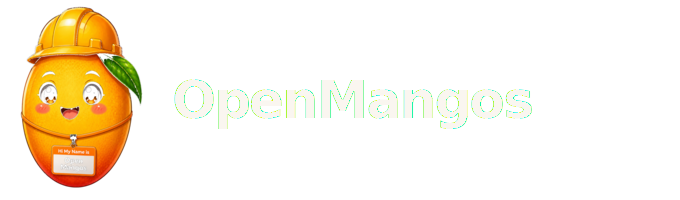

<p align="center">
  <picture>
    <source media="(prefers-color-scheme: light)" srcset="assets/openmangos-logo-text-dark.svg" />
    
  </picture>
</p>

<p align="center">
  <sub>The terminal adapts to the problem.<br />The model adapts to the terminal.</sub>
</p>

<p align="center">
  <a href="https://vektraindustries.com/openmango">Website</a>
  ·
  <a href="https://vektraindustries.com/openmango/install">Install</a>
  ·
  <a href="./CONCEPT.md">Concept</a>
  ·
  <a href="./CHANGELOG.md">Changelog</a>
  ·
  <a href="./assets/MASCOT.md">Mascot</a>
</p>

---

You already have the agents. **OpenMango** makes the terminal worthy of them.

Run `om`. It reads your codebase — the stack, the infra, what is actually running — and shapes itself around the work in front of you. The right mode. The right context. The right backend. One command. No new editor. No model lock-in.

OpenCode. Grok. Claude. Codex. Cursor. Orchestrated — with memory that compounds, healing when things drift, and verification when the session ends.

**The open bet:** premium agent surfaces keep closing behind tiers and APIs. OpenMango keeps the operator layer public — Apache-2.0, curl install, Mangos Drive on open [AgentDrive](https://github.com/PabloTheThinker/AgentDrive), forkable substrate. Not another fable you rent.

Built by [Vektra Industries](https://vektraindustries.com).

## Install

One line. Node 20+ and git.

```bash
curl -fsSL https://vektraindustries.com/openmango/install | bash
```

Clones to `~/.openmangos/src`. Builds `om`. Links globally. Walks you through onboarding.

Then:

```bash
om              # sense → recall → pack → launch
om onboard      # rerun setup
om update       # pull latest
```

## Sense. Adapt. Launch.

Most AI terminals treat every project the same. OpenMango does not.

**Sense** probes what matters — git, languages, frameworks, containers, cloud hooks, live processes. It builds a situation graph: mode, stack, infra, health.

**Adapt** shifts between build, debug, infra, review, and ship. The right tools. The right guardrails. The right verification — for *this* workspace.

**Launch** wraps your agent with a full context pack, syncs `AGENTS.md`, recalls memory, and opens the backend you chose.

```
you → om → sense · adapt · pack → agent
```

The terminal stops being a pipe. It becomes the operator.

## Mangos Drive

Memory should feel personal — not scattered across swarm IDs you never asked for.

OpenMango provisions **your** drive on [AgentDrive](https://vektraindustries.com/agentdrive): a named namespace with a workspace swarm for the project and a personal swarm that follows you across repos.

Recall on boot. Remember on exit. Structured memory that grows with your work — without asking you to manage the substrate.

```bash
om drive status
om recall
om remember
```

AgentDrive is the memory layer. OpenMango is how you operate it.

## Built for real work

**Real environments** — Docker, Kubernetes, Terraform, monorepos, brownfield code. Not just a lone `package.json`.

**Real workflows** — Route tasks to the best backend. Hand off between agents. Verify when work is done, not when the model stops talking.

**Real operators** — Doctor and heal fix what breaks. Reset and uninstall let you start clean — with or without your data. You commit. Always.

## Commands

| | |
|---|---|
| `om` | Bootstrap — sense, heal, pack, launch |
| `om sense` | What OpenMango knows about this workspace |
| `om pack --write` | Export the context pack agents read |
| `om doctor` | Health — backends, OpenCode, Mangos Drive |
| `om tui` | Orchestrator shell preview |

<details>
<summary><strong>All commands</strong></summary>

<br />

**Setup & lifecycle** — `om install` · `om onboard` · `om init` · `om update` · `om reset` · `om uninstall`

**Drive & memory** — `om drive status` · `om drive provision` · `om recall` · `om remember`

**Launch & routing** — `om boot` · `om run` · `om wrap` · `om route "task"` · `om handoff --to claude` · `om backends --set opencode`

**Modes & missions** — `om mode` · `om mission plan "goal"` · `om mission run` · `om roles` · `om tools`

**Quality** — `om verify` · `om heal` · `om watch` · `om session ls`

</details>

## Requirements

Node.js 20+. git. Python 3 for AgentDrive. At least one agent CLI on your PATH — OpenCode recommended.

**AgentDrive** powers Mangos Drive memory. `om onboard` checks for it and offers to install via the [official installer](https://vektraindustries.com/agentdrive/install).

## Develop

```bash
git clone https://github.com/PabloTheThinker/OpenMangos.git
cd OpenMangos
npm install && npm run build && npm link
om onboard
```

```bash
npm test
npm run dev -- sense
```

## How it fits together

OpenMango is the orchestration layer. Your agents are the runtime.

| | |
|---|---|
| **OpenMango (`om`)** | Sense, mode, context, memory, launch |
| **Your agent** | OpenCode, Grok, Claude, Codex, Cursor |
| **AgentDrive** | Memory substrate under Mangos Drive |
| **Warp** *(optional)* | Terminal host |

Phase 1: proven orchestration. Phase 2: a native terminal experience — built on top, not instead of.

The full vision lives in [CONCEPT.md](./CONCEPT.md).

## Configuration

Project state lives in `.openmangos/` — profile, config, context packs, Mangos Drive manifest.

`om wrap` injects environment variables (`OPENMANGOS_ROOT`, `OPENMANGOS_MODE`, `OPENMANGOS_CONTEXT`, …) and maintains a managed section in `AGENTS.md`. Everything outside those markers is yours.

## License

Apache-2.0 · [Vektra Industries](https://vektraindustries.com)

<p align="center">
  <sub>🥭</sub>
</p>